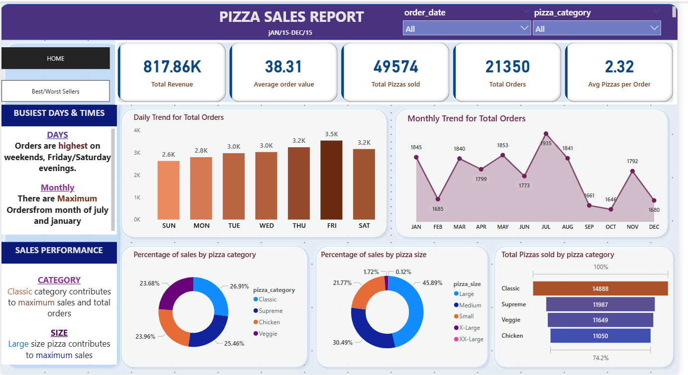

#  Pizza Sales Analysis Dashboard

This project provides a comprehensive analysis of pizza sales data using Microsoft SQL Server, Power BI, and Excel. It offers key business insights such as top-selling pizzas, sales trends, and category-wise performance.

##  Dashboard Highlights

-  Top 5 & Bottom 5 Pizzas by Revenue, Orders, and Quantity Sold
-  Day-wise and Category-wise analysis using SQL and Power BI
-  KPIs, Slicers, and Dynamic Filters for interactive insights

##  Tools Used

- **Microsoft SQL Server** – Data extraction and analysis
- **Power BI** – Dashboard creation and visualization
- **Excel** – Data pre-processing
- **DAX & SQL** – Calculated columns and advanced queries

##  Data Source

Dummy dataset: `pizza_sales.csv` (available in the repository)

##  Getting Started

1. Clone the repo
2. Open `pizzaSalesInsights.pbix` in Power BI Desktop
3. Use `first.sql` or the Word doc to recreate analysis in your SQL environment
4. Explore and interact with the dashboard

---

##  Author

**Drashti Sakhareliya**  
[LinkedIn](https://www.linkedin.com/in/drashti-sakhareliya-55b92b221)  
📧 drashtisakhareliya@gmail.com

---

##  Preview

